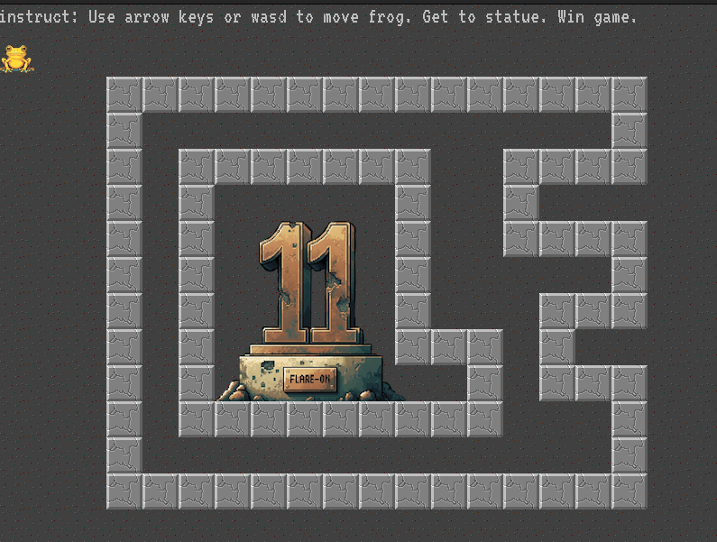

# Frog


Challenge program


<figure><figcaption><p>The game</p></figcaption></figure>

The aim of this challenge is to get the frog to the statue. The only problem is that there is no actual path from the starting point to the statue. However, since we have access to the source code, we could make modifications to it to allow us to get to the end point. Or, we could just print out the flag without even playing the game.

1.  Creating a path to the statue

    The blocks that make up the "maze" are defined near the end of the program. By just removing some of these "blocks" from the array we can open a path for the frog.

    ```python
    def BuildBlocks():
        blockset = [
            Block(3, 2, False),
            Block(4, 2, False),
            Block(5, 2, False),
            Block(6, 2, False),
            Block(7, 2, False),
            Block(8, 2, False),
            Block(9, 2, False),
            Block(10, 2, False),
            Block(11, 2, False),
            Block(12, 2, False),
    ...
    ```
2.  Print out the flag without playing the game

    The `GenerateFlagText()` function is what contains the encoded flag. The function is called in an if condition -&#x20;

    ```python
    if player.x == victory_tile.x and player.y == victory_tile.y:
        victory_mode = True
        flag_text = GenerateFlagText(player.x, player.y)
    ```

    This function can be called even when the player has not reached the statue. We just have to change the arguments passed to the function to `victory_title.x` and `victory_tile.y`.

    ```python
    flag_text = GenerateFlagText(int(victory_title.x), int(victory_title.y))
    ```
